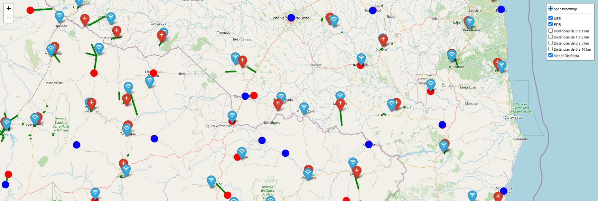
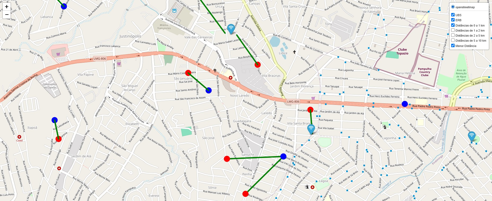

# Cálculo de Distâncias entre UBS e ERB

Este projeto tem como objetivo calcular as distâncias geográficas entre Unidades Básicas de Saúde (UBS) e Estações Rádio Base (ERB) usando dados de latitude e longitude. O processo envolveu a execução de um fluxo completo de **ETL (Extração, Transformação e Carga)**, o **merge de dois DataFrames** e o cálculo de distâncias utilizando os algoritmos **Haversine** e **KDTree**, considerando também **zonas geográficas** para otimização do processo.

